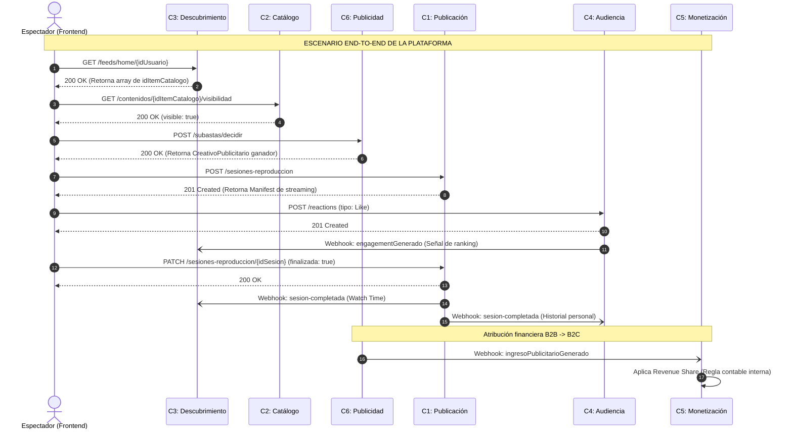

# Proyecto Final: Diseño de Software - YouTube Bounded Contexts

* **Institución:** Universidad de O'Higgins (UOH)
* **Profesor:** Edgardo Ortiz
* **Integrantes:** Marcelo Godoy - Eduardo Olivos - Sebastián Pérez

---

## Arquitectura Orientada a Dominios (DDD)

Este repositorio contiene el diseño arquitectónico de la plataforma YouTube, dividido estructuralmente en 6 *Bounded Contexts* independientes. El sistema evita la creación de un monolito central y, en su lugar, se integra mediante una arquitectura reactiva basada en eventos asíncronos (webhooks).

Cada directorio de este repositorio contiene:
1. La **Especificación OpenAPI 3.1.0** completa del contexto.
2. El **Diagrama de Clases Conceptual** aislando el modelo de dominio.

### Trazabilidad y Shared Kernel (RNF-2)
Para garantizar la integridad referencial a través de la red sin acoplar las bases de datos subyacentes, el ecosistema comparte estrictamente los siguientes identificadores:
* `idItemCatalogo` (UUID): Concepto editorial del video.
* `idCanal` (UUID): Entidad de negocio del creador.
* `idUsuario` (UUID): Espectador interactuando con la plataforma.

---

## Escenario Integrador End-to-End

> *"Un espectador ve un video recomendado, mira un anuncio, deja un like y el creador genera ingresos."*

A continuación se demuestra la orquestación cronológica de nuestras 6 APIs para satisfacer este flujo de negocio central. El diagrama prueba la comunicación entre servicios sin violar las fronteras de responsabilidad de cada dominio:

### Justificación de la Arquitectura
El flujo detallado prueba la resiliencia del sistema:
1. **Obtener recomendación:** El cliente contacta a **Descubrimiento (C3)** para obtener su feed personalizado.
2. **Validar que el contenido es visible:** Antes de reproducir, el cliente consulta a **Catálogo (C2)** para asegurar que el video no ha sido restringido por edad o políticas de moderación.
3. **Elegir anuncio:** Se ejecuta la subasta programática en tiempo real en **Publicidad (C6)**.
4. **Reproducir video:** El cliente establece la sesión con **Publicación (C1)**, el único contexto que maneja bytes, resoluciones y ancho de banda.
5. **Registrar Like:** La interacción social ocurre en **Audiencia (C4)**. C4 emite un evento asíncrono para que C3 actualice sus algoritmos.
6. **Registrar watch time:** Al finalizar la reproducción, **Publicación (C1)** dispara un webhook asíncrono. **Descubrimiento (C3)** lo captura para medir retención, y **Audiencia (C4)** para armar el historial del usuario.
7. **Atribuir ingreso al creador:** Una vez servido el comercial, **Publicidad (C6)** emite el evento financiero asíncrono hacia **Monetización (C5)**, quien consolida el balance contable del creador.
