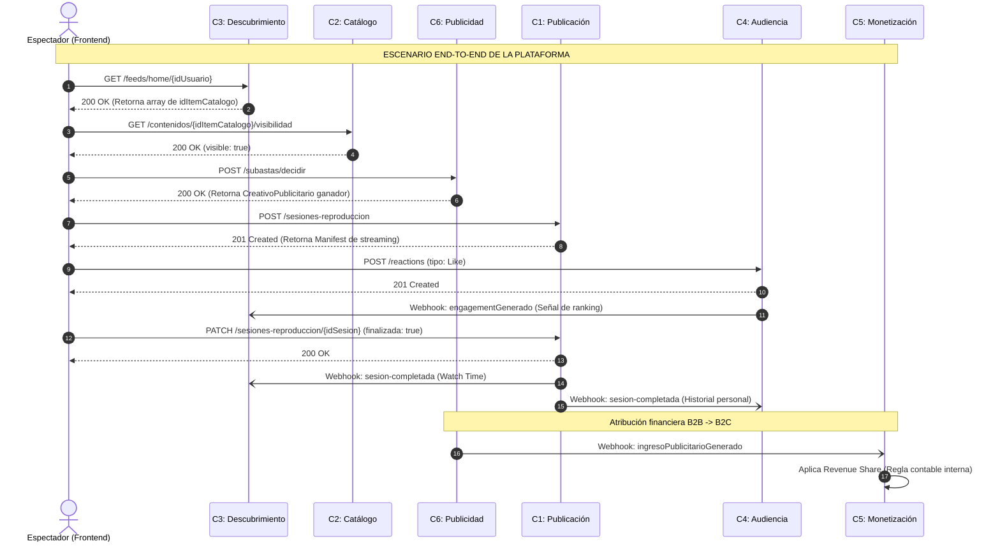

# Proyecto Final: Diseño de Software - YouTube Bounded Contexts
* **Institución:** Universidad de O'Higgins (UOH)
* **Profesor:** Edgardo Ortiz
* **Integrantes:** Marcelo Godoy - Eduardo Olivos - Sebastián Pérez

### Justificación del Escenario Integrador
El flujo demuestra la estricta separación de responsabilidades a través del *Shared Kernel* (utilizando `idItemCatalogo` y `idUsuario` como referencias globales). Ningún servicio resuelve todo; la plataforma se comporta como un sistema distribuido y reactivo:

1. **Obtener recomendación:** El cliente contacta a **Descubrimiento (C3)** para obtener su feed personalizado. C3 retorna solo referencias, no el archivo de video.
2. **Validar que el contenido es visible:** Antes de reproducir, el cliente consulta a **Catálogo (C2)** para asegurar que el video no ha sido restringido por edad o geolocalización en los últimos milisegundos.
3. **Elegir anuncio:** Se ejecuta la subasta en tiempo real en **Publicidad (C6)**.
4. **Reproducir video:** El cliente establece la sesión de streaming con **Publicación (C1)**, el único contexto que maneja el ancho de banda y los bytes del archivo.
5. **Registrar Like:** La interacción social ocurre en **Audiencia (C4)**. C4 emite un evento asíncrono para que C3 actualice sus algoritmos de recomendación en segundo plano.
6. **Registrar watch time:** Al finalizar la reproducción, **Publicación (C1)** dispara un webhook asíncrono. **Descubrimiento (C3)** lo captura para medir la retención, y **Audiencia (C4)** lo captura para armar el historial del usuario.
7. **Atribuir ingreso al creador:** Una vez servido el comercial, **Publicidad (C6)** emite el evento financiero asíncrono hacia **Monetización (C5)**, quien aplica el *Revenue Share* sin acoplar las bases de datos de anunciantes y creadores.
