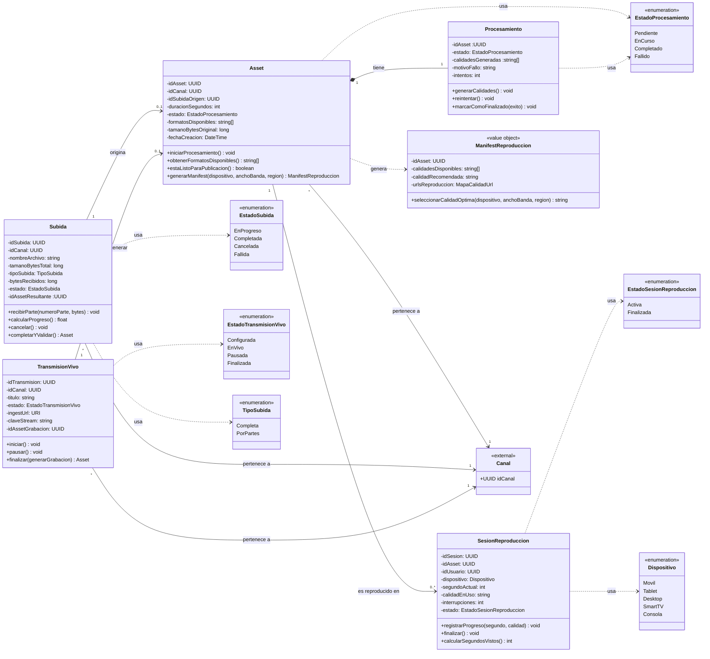

# Bounded Contexts 1: Publicación y Distribución de Contenido

## 1. Descripción de Responsabilidad
Gestionar el ciclo de vida técnico del contenido de video en la plataforma. Permite a los creadores iniciar una Subida de su archivo (completa o por partes), monitoreando su progreso hasta su validación. Una vez finalizada la subida, el sistema dispara automáticamente el Procesamiento del archivo, generando múltiples calidades del mismo Asset (360p, 720p, 1080p) y permitiendo reintentar procesamientos fallidos. Además, administra las Sesiones de Reproducción, entregando la información necesaria para reproducir un asset según el dispositivo, ancho de banda y región del espectador, y capturando métricas técnicas de visualización (duración vista, calidad, interrupciones). El contexto también soporta Transmisiones en Vivo, proveyendo los datos de conexión para emitir desde software externo y permitiendo iniciar, pausar y finalizar la transmisión, con la posibilidad de generar una versión grabada al término del live. Notifica a otros contextos cuando un asset está técnicamente listo para ser publicado, sin tomar ninguna decisión sobre su visibilidad pública ni gestionar su metadata editorial (título, descripción, tags).

---

## 2. Especificación OpenAPI
El contrato formal de la API de este contexto junto con sus endpoints, estructuras de datos (schemas), paginación y gestión de errores, se encuentra en el siguiente archivo:
* 📄 [Ver Especificación OpenAPI](./openapi_publicacion.yaml)

---

## 3. Diagrama de Clases Conceptual 
A continuación se presenta el modelo de datos canónico y las relaciones estrictas para el contexto de Publicación y Distribución de Contenido:

---

## 4. Diagrama de Secuencia

A continuación se modela el comportamiento dinámico del sistema durante el escenario integrador exigido por la cátedra, en la porción donde Publicación y Distribución de Contenido (Contexto 1) actúa como protagonista. El diagrama detalla cómo Publicación valida de forma síncrona la visibilidad del contenido junto a Catálogo editorial y derechos (Contexto 2) antes de servir el manifest de reproducción, gestiona el ciclo completo de la sesión de playback, y finalmente notifica de manera asíncrona y desacoplada a Descubrimiento y personalización (Contexto 3) las métricas de visualización (watch time, calidad, interrupciones), sin que Publicación dependa de la disponibilidad ni del procesamiento de ese contexto consumidor.
