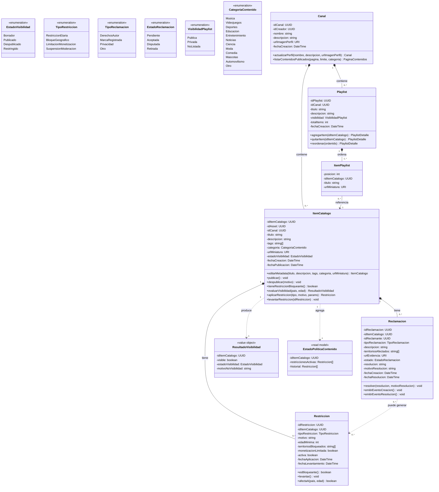
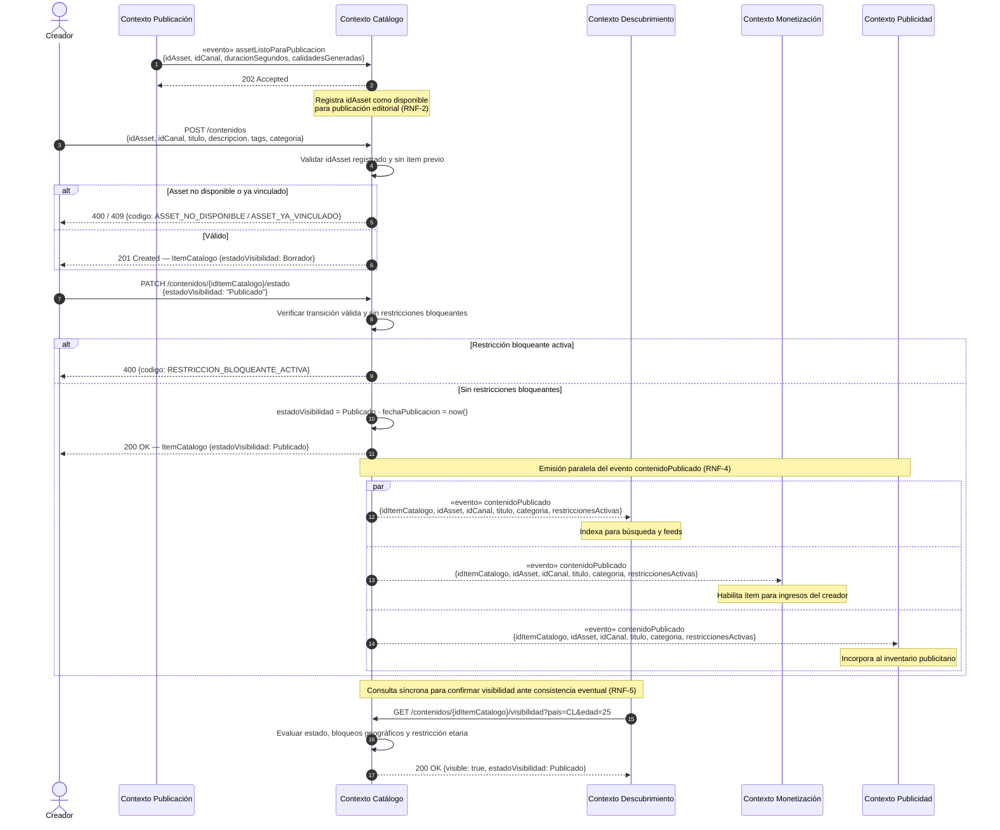

# Bounded Contexts 2: Catálogo Editorial y Derechos

## 1. Descripción de Responsabilidad
Definir qué contenido existe públicamente y bajo qué reglas puede mostrarse. Permite vincular un Asset técnico (proveniente del contexto de Publicación) con su metadata editorial (título, descripción, tags, categoría y miniatura) dando origen a un Ítem de Catálogo, que puede mantenerse en estado Borrador antes de ser Publicado o Despublicado. Cada Canal asociado a un creador administra su información pública y el listado de su contenido publicado, así como Playlists: colecciones ordenadas de ítems que pueden reordenarse libremente. El contexto aplica Restricciones de Política (edad mínima, bloqueo geográfico, limitación de monetización) y resuelve Reclamaciones de Derechos sobre un ítem, pudiendo restringir su disponibilidad como consecuencia de ellas, manteniendo siempre el historial de estado de política de cada contenido. Notifica a otros contextos cuando un ítem cambia su condición de publicado o deja de estarlo.

---

## 2. Especificación OpenAPI
El contrato formal de la API de este contexto junto con sus endpoints, estructuras de datos (schemas), paginación y gestión de errores, se encuentra en el siguiente archivo:
* 📄 [Ver Especificación OpenAPI](./openapi_catalogo.yaml)

---

## 3. Diagrama de Clases Conceptual 
A continuación se presenta el modelo de datos canónico y las relaciones estrictas para el contexto de Catálogo Editorial y Derechos:

---

## 4. Diagrama de Secuencia

A continuación se modela el comportamiento dinámico del sistema durante el escenario integrador exigido por la cátedra, en la porción donde Catálogo Editorial y Derechos (Contexto 2) actúa como protagonista. El diagrama detalla cómo Catálogo consume de forma asíncrona el evento "assetListoParaPublicacion" emitido por Publicación y Distribución de Contenido (Contexto 1) para habilitar la creación del ítem editorial, gestiona el ciclo de vida completo del contenido desde su estado Borrador hasta Publicado (incluyendo la validación interna de restricciones bloqueantes), y finalmente notifica en paralelo y de manera desacoplada a Descubrimiento y Personalización (Contexto 3), Monetización del Ecosistema Creador (Contexto 5) y Publicidad y Marketplace de Anunciantes (Contexto 6) mediante el evento contenidoPublicado, exponiendo además una consulta síncrona de visibilidad que permite a los contextos consumidores confirmar la elegibilidad del contenido frente a la consistencia eventual del sistema.

