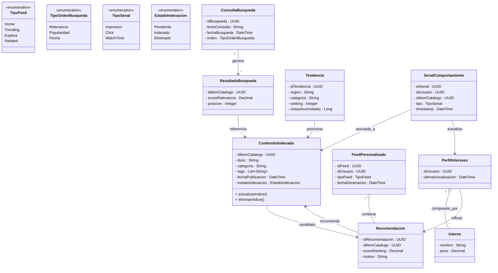

# Bounded Contexts 3: Descubrimiento y Personalización

## 1. Descripción de Responsabilidad

Gestionar el descubrimiento y la personalización de contenido para los espectadores de la plataforma. Permite indexar y organizar el contenido publicado por el Catálogo Editorial, ofrecer mecanismos de búsqueda de videos y canales, generar feeds personalizados y recomendaciones basadas en los intereses y comportamiento de cada usuario.

Además, incorpora señales de interacción provenientes de distintos contextos (impresiones, clics, tiempo de visualización y métricas de engagement) para construir perfiles dinámicos de intereses y alimentar los algoritmos de ranking. También calcula tendencias por región, categoría o temática, permitiendo la exploración de contenido popular y relevante.

Este contexto incluye un motor de recomendación que evalúa la similitud temática entre contenidos, el historial de consumo de los usuarios y las señales de engagement agregadas para determinar el orden y relevancia de los resultados presentados. Asimismo, administra el índice de búsqueda utilizado para recuperar contenido de forma eficiente y consistente con las reglas de visibilidad definidas por Catálogo Editorial.

Asimismo, mantiene mecanismos de integración asíncrona con los contextos de Catálogo Editorial y Publicación para indexar contenido publicado, desindexar contenido retirado y actualizar los algoritmos de recomendación mediante señales reales de consumo.

Su responsabilidad se limita a determinar qué contenido debe ser descubierto por cada usuario y en qué orden presentarlo. No almacena comentarios, suscripciones o reacciones sociales, no reproduce contenido multimedia y no decide las políticas de visibilidad o monetización de los videos.

---

## 2. Especificación OpenAPI

El contrato formal de la API con sus endpoints, estructuras de datos (schemas), paginación y gestión de errores se encuentra en el siguiente archivo:

* 📄 Ver Especificación OpenAPI

---

## 3. Diagrama de Clases Conceptual

A continuación se presenta el modelo de datos canónico y las relaciones estrictas para el contexto de Descubrimiento y Personalización:



---

## 4. Diagrama de Secuencia

A continuación se modela el comportamiento dinámico y asíncrono del sistema ante el escenario integrador definido por la cátedra. El diagrama muestra cómo Descubrimiento genera recomendaciones personalizadas consumiendo información proveniente de Catálogo, Audiencia y Publicación.

```mermaid
sequenceDiagram
    autonumber

    participant C2 as C2: Catálogo
    participant C3 as C3: Descubrimiento
    participant C4 as C4: Audiencia
    participant C1 as C1: Publicación
    actor User as Espectador

    %% --- INDEXACIÓN DE CONTENIDO ---
    Note over C2,C3: RF-D6 Indexación de contenido

    C2-)C3: Evento ContenidoPublicado
    C3->>C3: Actualiza índice de búsqueda
    C3-->>C2: 202 Accepted

    %% --- GENERACIÓN DEL FEED ---
    Note over User,C3: RF-D2 Feed personalizado

    User->>C3: GET /feeds/home/{idUsuario}

    critical Motor de Personalización
        C3->>C3: Consulta perfil de intereses
        C3->>C3: Calcula ranking
        C3->>C3: Genera recomendaciones
    end

    C3-->>User: 200 OK (FeedPersonalizado)

    %% --- IMPRESIÓN ---
    Note over User,C3: RF-D5 Registro de impresión

    User->>C3: POST /signals/impressions
    C3->>C3: Actualiza métricas de exposición
    C3-->>User: 201 Created

    %% --- CLICK SOBRE RECOMENDACIÓN ---
    Note over User,C3: RF-D5 Registro de click

    User->>C3: POST /signals/clicks
    C3->>C3: Incrementa score de interés
    C3-->>User: 201 Created

    %% --- WATCH TIME DESDE PUBLICACIÓN ---
    Note over C1,C3: Integración asíncrona

    C1-)C3: Evento SesionReproduccionCompletada
    C3->>C3: Actualiza perfil de intereses
    C3->>C3: Recalcula pesos de recomendación

    %% --- ENGAGEMENT DESDE AUDIENCIA ---
    Note over C4,C3: Integración de señales sociales

    C4-)C3: Evento EngagementRegistrado
    C3->>C3: Actualiza ranking del contenido

    %% --- RECOMENDACIÓN FUTURA ---


sequenceDiagram
    autonumber

    actor Usuario as Espectador
    participant C4 as C4: Audiencia
    participant C3 as C3: Descubrimiento
    participant Canal as Canal/Creador

    Usuario->>C4: POST /suscripciones
    C4->>C4: Registra suscripción
    C4-->>Usuario: 201 Creado

    C4->>C4: Genera notificaciones

    Usuario->>C4: POST /comentarios
    C4->>C4: Guarda comentario
    C4-->>Usuario: 201 Creado

    Usuario->>C4: POST /reacciones
    C4->>C4: Actualiza engagement
    C4-->>Usuario: 201 Creado

    C4-)C3: Evento EngagementRegistrado
    C3->>C3: Actualiza ranking

    Canal->>C4: POST /publicaciones-comunidad
    C4->>C4: Registra publicación
    C4-->>Canal: 201 Creado

    Usuario->>C4: GET /notificaciones
    C4-->>Usuario: Lista de notificaciones
    Note over C3: El contenido con mejor ranking aparecerá en futuros feeds
```
