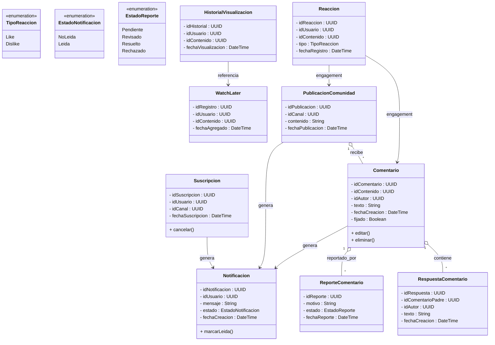
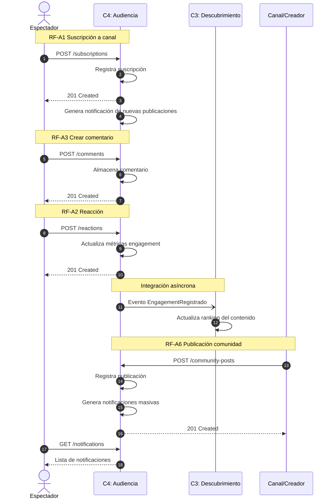

# Bounded Contexts 4: Audiencia, Comunidad y Engagement

## 1. Descripción de Responsabilidad

Gestionar la interacción social entre los usuarios, creadores y contenidos de la plataforma. Permite a los espectadores suscribirse a canales, reaccionar a videos mediante likes o dislikes, participar en conversaciones a través de comentarios y respuestas, gestionar listas de reproducción personales y mantener historiales de visualización.

Además, administra las publicaciones de comunidad realizadas por los creadores, las notificaciones generadas por actividades relevantes y las métricas de engagement derivadas de la interacción social de los usuarios. Este contexto constituye la principal fuente de señales sociales para los sistemas de recomendación y análisis de comportamiento de la plataforma.

Asimismo, es responsable de mantener las relaciones entre audiencia y creadores, registrar eventos de participación y proveer mecanismos para moderar contenido generado por usuarios, incluyendo reportes, fijación de comentarios y configuración de preferencias de notificaciones.

Su responsabilidad se limita a la gestión de la comunidad y las interacciones sociales. No administra la reproducción de contenido multimedia, la indexación de videos, los algoritmos de recomendación, los derechos editoriales ni la monetización de creadores o anunciantes.

---

## 2. Especificación OpenAPI

El contrato formal de la API con sus endpoints, estructuras de datos (schemas), paginación y gestión de errores se encuentra en el siguiente archivo:

* 📄 Ver Especificación OpenAPI (./openapi_audiencia.yaml)

---

## 3. Diagrama de Clases Conceptual

A continuación se presenta el modelo de datos canónico y las relaciones estrictas para el contexto de Audiencia, Comunidad y Engagement:

---

## 4. Diagrama de Secuencia

A continuación se modela el comportamiento dinámico y asíncrono del sistema ante un escenario de participación de la audiencia. El diagrama muestra cómo una interacción social genera engagement y eventos consumidos posteriormente por otros contextos.

