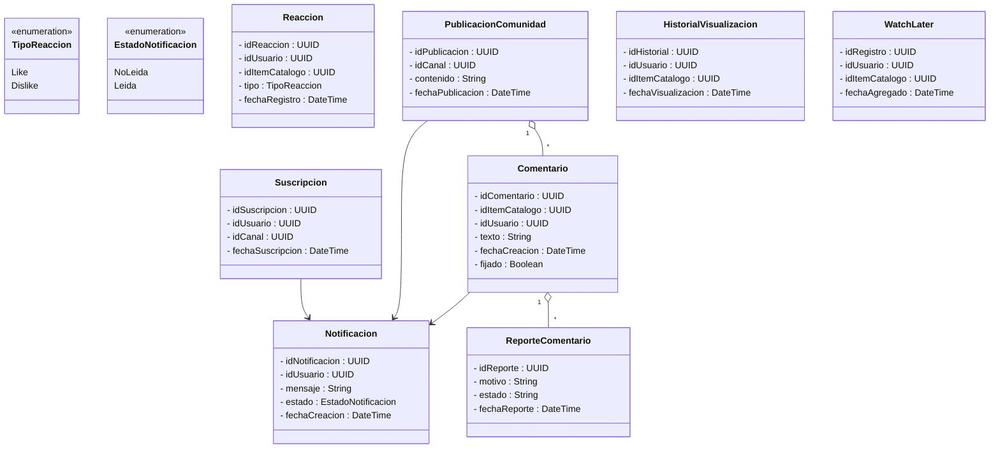
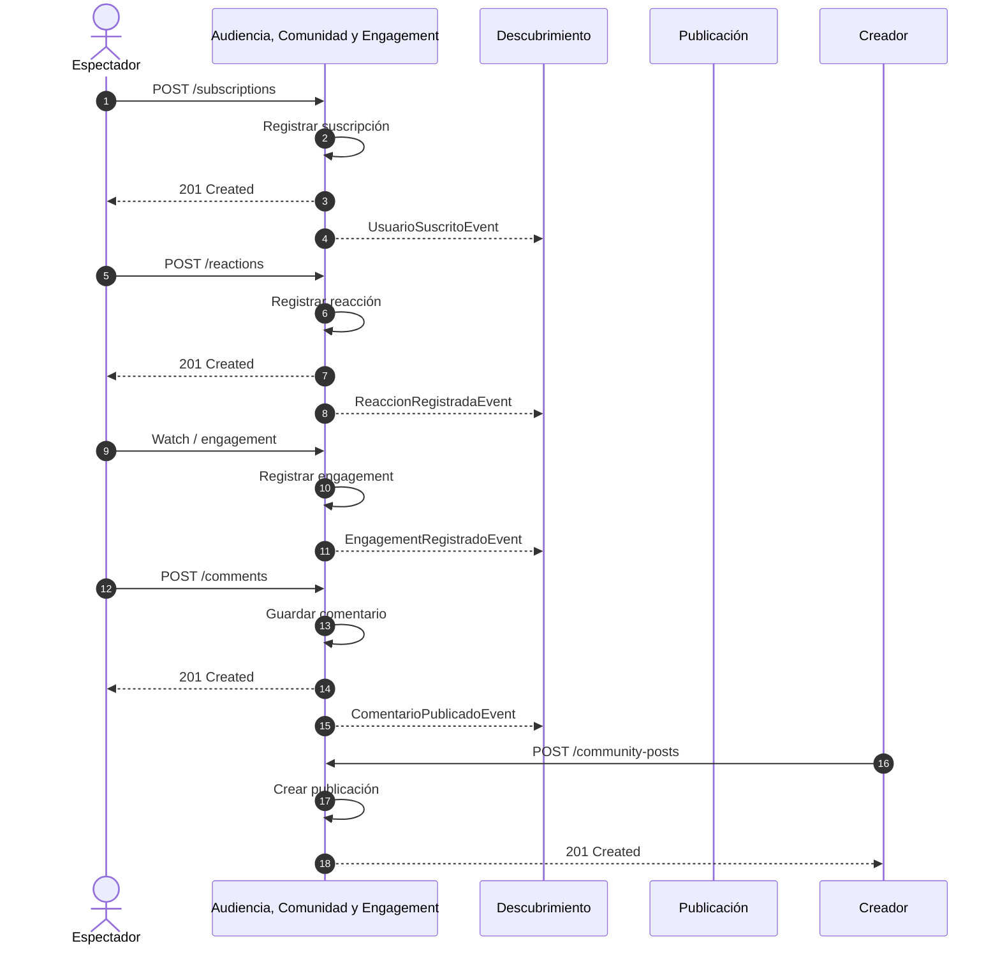

# Bounded Contexts 4: Audiencia, Comunidad y Engagement

## 1. Descripción de Responsabilidad

Gestionar la interacción social entre los usuarios, creadores y los ítems del catálogo de la plataforma. Permite a los espectadores suscribirse a canales, reaccionar a ítems de contenido mediante likes o dislikes, participar en conversaciones a través de comentarios y respuestas, y administrar la relación social con los creadores.

Además, administra las publicaciones de comunidad realizadas por los creadores, las notificaciones generadas por eventos relevantes y las señales de engagement derivadas de la interacción de los usuarios con el contenido.

Este contexto constituye la principal fuente de eventos sociales del sistema, los cuales son consumidos por el contexto de Descubrimiento para personalización y ranking.

Asimismo, es responsable de registrar y emitir eventos de interacción como suscripciones, comentarios, reacciones y engagement, los cuales son utilizados por otros contextos para análisis y recomendación.

Su responsabilidad se limita a la gestión de la capa social y de interacción. No administra la reproducción de video, la indexación de contenido, los algoritmos de recomendación, los derechos editoriales ni la monetización.

---

## 2. Especificación OpenAPI

El contrato formal de la API con sus endpoints, estructuras de datos y eventos de dominio se encuentra en:

📄 Ver Especificación OpenAPI (./openapi_audiencia.yml)

---

## 3. Modelo de Dominio (Clases)

---

## 4. Diagrama de Secuencia (Flujo Integrador)

