# Bounded Contexts 6: Publicidad y Marketplace de Anunciantes

## 1. Descripción de Responsabilidad
Gestionar el negocio publicitario B2B de la plataforma. Permite a cuentas empresariales (Anunciantes) registrar sus datos de facturación, administrar el ciclo de vida de sus Campañas Publicitarias (presupuestos, vigencia y objetivos), subir sus comerciales (Creativos) y definir reglas de segmentación (Targeting). Además, cuenta con un motor de subastas en tiempo real que evalúa las oportunidades de visualización en base a la elegibilidad del inventario (Brand Safety) y calcula las métricas de rendimiento (CTR, CPM) para emitir las facturas (Invoices) correspondientes.

---

## 2. Especificación OpenAPI
El contrato formal de la API con sus endpoints, estructuras de datos (schemas), paginación y gestión de errores se encuentra en el siguiente archivo:
* 📄 [Ver Especificación OpenAPI](./openapi.yaml)

---

## 3. Diagrama de Clases Conceptual
A continuación se presenta el modelo de datos canónico y las relaciones estricta para el contexto publicitario:

```mermaid
classDiagram
    direction TB

    %% --- ENUMERADOS (Aislados como diccionario de datos estandarizado) ---
    class EstadoFinanciero {
        <<enumeration>>
        AlDia
        Moroso
        Suspendido
    }
    class EstadoCampana {
        <<enumeration>>
        Creada
        Activa
        Pausada
        Agotada
        Finalizada
    }
    class TipoFormato {
        <<enumeration>>
        PreRoll
        MidRoll
        Bumper
        Display
    }
    class EstadoAprobacion {
        <<enumeration>>
        Pendiente
        Aprobado
        Rechazado
    }
    class EstadoSeguridadMarca {
        <<enumeration>>
        Seguro
        Restringido
        Inapropiado
    }
    class TipoInteraccion {
        <<enumeration>>
        Impresion
        Click
        Skip
    }
    class EstadoPago {
        <<enumeration>>
        Pendiente
        Pagada
        Vencida
    }

    %% --- DOMINIO: GESTIÓN COMERCIAL (B2B) ---
    class Anunciante {
        - idAnunciante : UUID
        - razonSocial : String
        - rutFacturacion : String
        - direccionFacturacion : String
        - monedaPreferencia : String
        - metodoPagoId : String
        - estadoFinanciero : EstadoFinanciero
    }

    class FacturaAnunciante {
        - idFactura : UUID
        - idAnunciante : UUID
        - periodoCobro : String
        - montoTotalFacturado : Decimal
        - fechaEmision : DateTime
        - estadoPago : EstadoPago
    }

    class CampanaPublicitaria {
        - idCampana : UUID
        - idAnunciante : UUID
        - objetivo : String
        - presupuestoTotal : Decimal
        - presupuestoRestante : Decimal
        - fechaInicio : DateTime
        - fechaFin : DateTime
        - estado : EstadoCampana
    }

    class CriterioTargeting {
        - idTargeting : UUID
        - idCampana : UUID
        - paisesObjetivo : List~String~
        - edadMinima : Int
        - edadMaxima : Int
        - categoriasContenido : List~String~
        - interesesUsuario : List~String~
        + estimarInventarioDisponible() Long
    }

    class ReporteRendimiento {
        - idCampana : UUID
        - impresionesTotales : Long
        - clicksTotales : Long
        - skipsTotales : Long
        - gastoAcumulado : Decimal
        + calcularCTR() Decimal
        + calcularCPM() Decimal
    }

    %% --- DOMINIO: INVENTARIO Y CREATIVOS ---
    class CreativoPublicitario {
        - idCreativo : UUID
        - idCampana : UUID
        - urlResource : String
        - tipoFormato : TipoFormato
        - duracionSegundos : Int
        - estadoAprobacion : EstadoAprobacion
        - motivoRechazo : String
    }

    class InventarioContenido {
        - idItemCatalogo : UUID
        - idCanal : UUID
        - esMonetizable : Boolean
        - categoriaContenido : String
        - estadoSeguridadMarca : EstadoSeguridadMarca
    }

    %% --- DOMINIO: MOTOR TRANSACCIONAL Y TELEMETRÍA ---
    class OportunidadVisualizacion {
        - idOportunidad : UUID
        - idItemCatalogo : UUID
        - paisEspectador : String
        - edadEspectador : Int
        - formatoSolicitado : TipoFormato
        + decidirAnuncioMostrar(campanasActivas: List) CreativoPublicitario
    }

    class RegistroInteraccionAd {
        - idInteraccion : UUID
        - idCreativo : UUID
        - tipoInteraccion : TipoInteraccion
        - costoGatillado : Decimal
        - timestamp : DateTime
    }

    %% --- RELACIONES UML ESTRICTAS ---
    
    %% Composición Fuerte (Ciclo de vida atado al Anunciante)
    Anunciante "1" *-- "0..*" FacturaAnunciante : recibe
    Anunciante "1" *-- "0..*" CampanaPublicitaria : financia

    %% Composición Interna de la Campaña
    CampanaPublicitaria "1" *-- "1" CriterioTargeting : segmenta_por
    CampanaPublicitaria "1" *-- "1" ReporteRendimiento : monitorea_con
    CampanaPublicitaria "1" *-- "1..*" CreativoPublicitario : despliega

    %% Asociaciones y Dependencias Operativas
    InventarioContenido "1" <-- "0..*" OportunidadVisualizacion : origina
```




## 4. Diagrama de Secuencia

A continuación se modela el comportamiento dinámico y asíncrono del sistema ante el escenario integrador exigido por la cátedra. El diagrama detalla cómo el motor de publicidad (Contexto 6) interactúa de manera desacoplada con Descubrimiento (Contexto 3), Publicación (Contexto 1) y Monetización (Contexto 5) para procesar la subasta en tiempo real y emitir la telemetría sin degradar la experiencia del usuario.

```mermaid
sequenceDiagram
    autonumber
    actor Espectador as Espectador (Frontend)
    participant C3 as C3: Descubrimiento
    participant C1 as C1: Publicación
    participant C6 as C6: Publicidad
    participant C5 as C5: Monetización

    %% --- ETAPA 1: DESCUBRIMIENTO Y REPRODUCCIÓN ---
    Espectador->>C3: GET /feeds/home (Pide recomendaciones)
    C3-->>Espectador: Retorna lista de videos recomendados (IDs)
    Espectador->>Espectador: Usuario hace Click en un video recomendado

    %% --- ETAPA 2: LA SUBASTA DE ANUNCIOS (NUESTRO CORE) ---
    Note over Espectador, C6: Oportunidad de Visualización detectada antes del Playback
    Espectador->>C6: POST /subastas/decidir (Envía datos del espectador y video ID)
    critical Ejecución Interna de la Subasta (Baja Latencia)
        C6->>C6: Verifica base de datos local (InventarioContenido)
        Note over C6: Valida: esMonetizable == true y BrandSafety == Seguro
        C6->>C6: Filtra campañas activas por Targeting (País, Edad, Categoría)
        C6->>C6: Evalúa pujaMaximaCPM de las campañas finalistas
    end
    C6-->>Espectador: Retorna CreativoPublicitario ganador (URL del ad y AdTransactionToken)

    %% --- ETAPA 3: PLAYBACK E INTERACCIÓN ---
    Espectador->>C1: GET /playback/session (Inicia stream técnico del video)
    Espectador->>Espectador: El reproductor inserta e inyecta el video del anuncio bruto
    Espectador->>Espectador: El espectador mira el anuncio completo (Impresión Facturable)

    %% --- ETAPA 4: TELEMETRÍA Y DISTRIBUCIÓN DE INGRESOS ---
    Espectador->>C6: POST /telemetria/interacciones (Envía token y tipoInteraccion: Impresion)
    C6-->>Espectador: 201 Created (Confirmación de recepción de telemetría)
    Note over C6: El hilo de la subasta se libera. El usuario sigue viendo su video en paz.

    %% --- INTEGRACIÓN ASÍNCRONA (RNF-4) ---
    Note over C6, C5: Desacoplamiento por mensajería (Consistencia Eventual)
    C6->>C5: Webhook: ingresoPublicitarioGenerado (idCanal, montoTotalPlataforma, timestamp)
    C5-->>C6: 202 Accepted (Monetización recibe el dinero bruto y procesa revenue share)
    
    OportunidadVisualizacion ..> CampanaPublicitaria : evalua_elegibilidad
    OportunidadVisualizacion ..> CreativoPublicitario : inyecta_ganador

    CreativoPublicitario "1" <-- "0..*" RegistroInteraccionAd : recolecta
