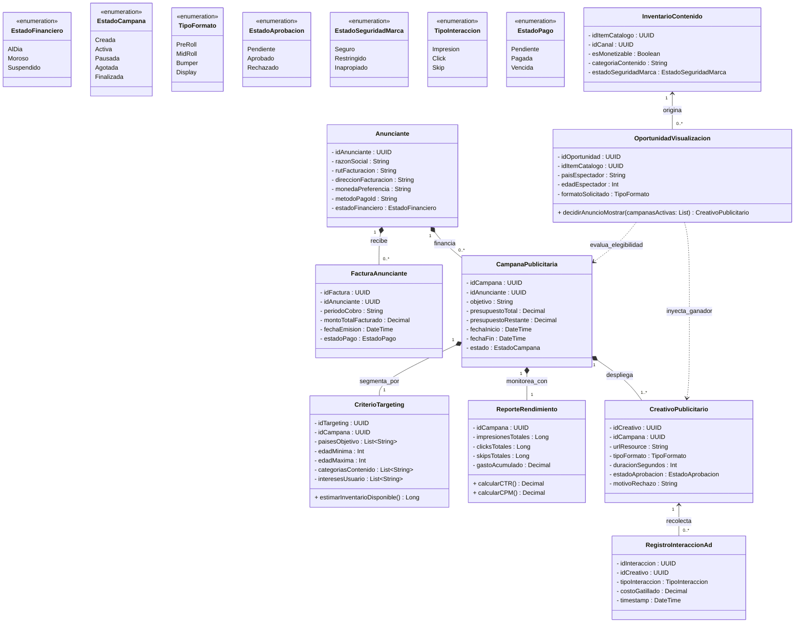

# Bounded Contexts 6: Publicidad y Marketplace de Anunciantes

## 1. Descripción de Responsabilidad
Gestionar el negocio publicitario B2B de la plataforma. Permite a cuentas empresariales (Anunciantes) registrar sus datos de facturación, administrar el ciclo de vida de sus Campañas Publicitarias (presupuestos, vigencia y objetivos), subir sus comerciales (Creativos) y definir reglas de segmentación (Targeting). Además, cuenta con un motor de subastas en tiempo real que evalúa las oportunidades de visualización en base a la elegibilidad del inventario (Brand Safety) y calcula las métricas de rendimiento (CTR, CPM) para emitir las facturas (Invoices) correspondientes.

---

## 2. Especificación OpenAPI
El contrato formal de la API con sus endpoints, estructuras de datos (schemas), paginación y gestión de errores se encuentra en el siguiente archivo:
* 📄 [Ver Especificación OpenAPI](./openapi.yaml)

---

## 3. Diagrama de Clases Conceptual
A continuación se presenta el modelo de datos canónico y las relaciones estrictas para el contexto publicitario:



---

## 4. Diagrama de Secuencia

A continuación se modela el comportamiento dinámico y asíncrono del sistema ante el escenario integrador exigido por la cátedra. El diagrama detalla cómo el motor de publicidad (Contexto 6) interactúa de manera desacoplada con Descubrimiento (Contexto 3), Publicación (Contexto 1) y Monetización (Contexto 5) para procesar la subasta en tiempo real y emitir la telemetría sin degradar la experiencia del usuario.

```mermaid
sequenceDiagram
    autonumber
    participant C2 as C2: Catálogo
    actor App as Frontend (Reproductor)
    participant C6 as C6: Publicidad (Nosotros)
    participant C5 as C5: Monetización

    %% --- INTEGRACIÓN ENTRANTE (Catálogo -> Publicidad) ---
    Note over C2, C6: RNF-5: Sincronización asíncrona de elegibilidad (RF-F5)
    C2->>C6: PUT /inventario/{idItemCatalogo} (esMonetizable, BrandSafety)
    C6-->>C2: 200 OK

    %% --- TRANSACCIÓN CORE (Frontend <-> Publicidad) ---
    Note over App, C6: RF-F6: El usuario visualiza un video (Oportunidad)
    App->>C6: POST /subastas/decidir (idItemCatalogo, datosEspectador)
    
    critical Motor Transaccional de Subasta
        C6->>C6: Filtra inventario local y campañas activas
        C6->>C6: Resuelve pujaMaximaCPM y targeting
    end
    
    C6-->>App: 200 OK (Retorna CreativoPublicitario + AdTransactionToken)

    Note over App, C6: RF-F7: El anuncio finaliza su reproducción
    App->>C6: POST /telemetria/interacciones (Token, tipoInteraccion: Impresion)
    C6->>C6: Descuenta saldo de la Campaña (Presupuesto)
    C6-->>App: 201 Created

    %% --- INTEGRACIÓN SALIENTE (Publicidad -> Monetización) ---
    Note over C6, C5: RNF-4: Emisión de ingresos al ecosistema creador
    C6-)C5: Webhook: ingresoPublicitarioGenerado (idCanal, montoTotal)
    C5-->>C6: 202 Accepted
